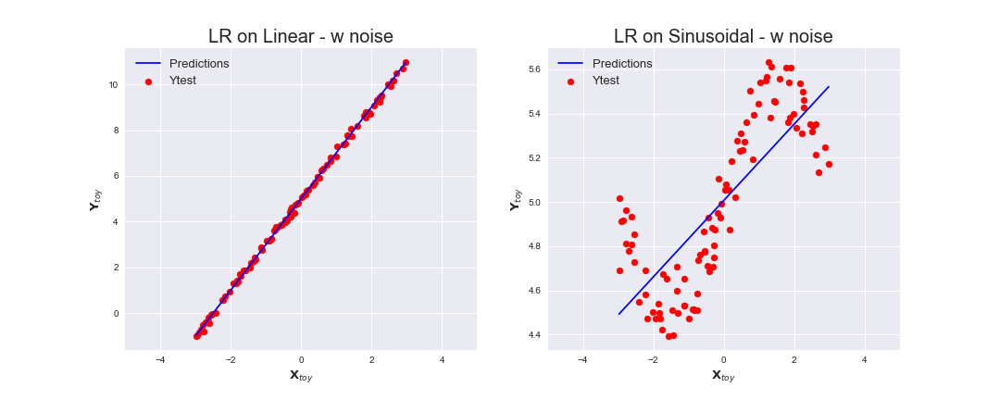
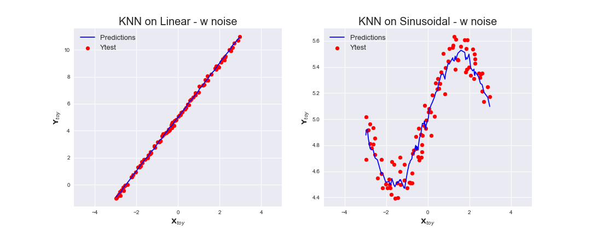
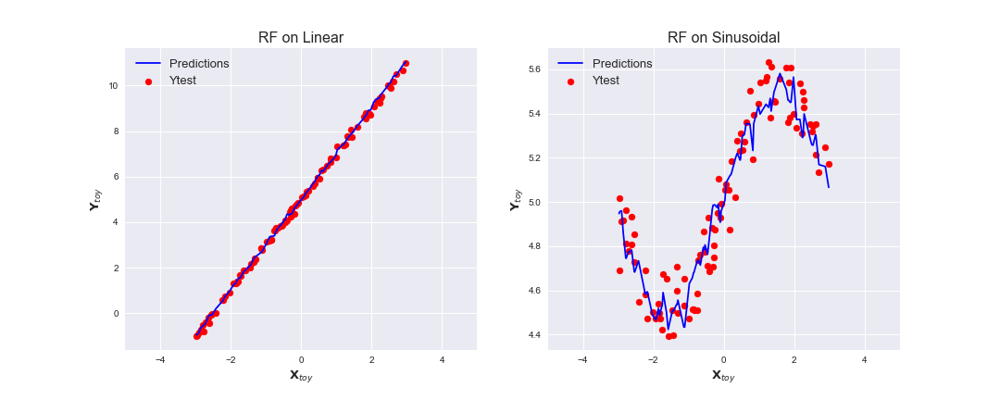
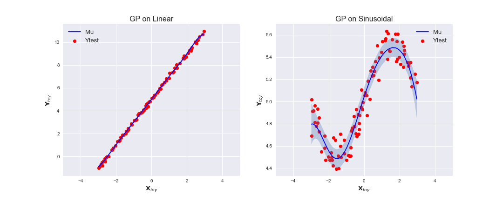

# SARCOS Problem

## Intro
The SARCOS data relates to an inverse dynamics problem which uses kinematic measurements to calculate the joint torques in a rigid body, Faber, Soest and Kistemaker (2018). In this specific case the data is given in a 21-dimensional space (containing: Position, velocity and acceleration for 7 degrees of freedom) with the output data being the torque of one motor of a robotic arm, hence the data contains 22 features and 44,484 exemplars, gaussianprocess.org (2006).

By first implementing a ‘Toy problem’ we create and train algorithms of four different machine learning techniques K Nearest Neighbours, Linear Regression, Random Forest Regression and Gaussian Process, in which we implement to the SARCOS regression problem in order to predict the torque.

We plot the out of sample predictions of the 4 algorithms on the Toy problem:

Results:

|         Model        | MSE (Best Run) | 
| ---------------------| ---------------|
|   Gaussian Process   | 8.930          |
| K-Nearest Neighbours | 9.210          |
|  Linear Regression   | 17.277         |
|    Random Forest     | 20.299         |
